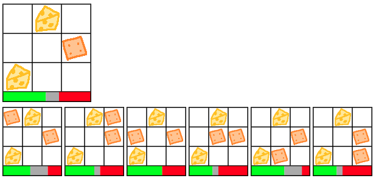

# Cheese and Crackers

Brute force visualization of Tic-Tac-Toe decision tree.

Current state of game is depicted at the top. Possible next moves are shown below. Click a next move to progress.

Green bar indicates chances of winning, gray bar indicates chances of tying, and red bar indicates chances of losing.



## Compile

Build to JavaScript by making sure the `tsc` TypeScript compiler is installed and then running it:
```bash
tsc
```

## Run

Run a test web server, for example:
```bash
python -m http.server
```

And then navigate in your browser to `http://localhost:8000/`
